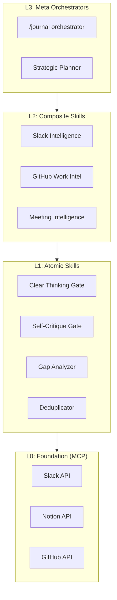
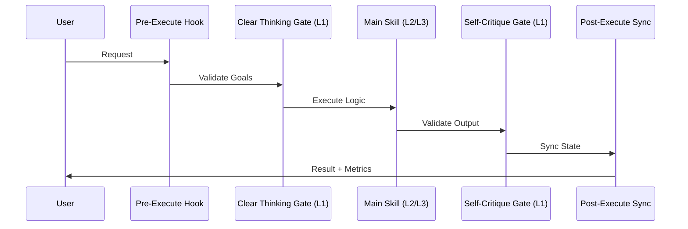

# Architecture Deep Dive

This document details the layered system architecture and data flow principles of the Claude Boost framework.

## 3-Layer Capability Model

Claude Boost organizes AI agent capabilities into three distinct layers to ensure modularity and clear boundaries.

### Layer Responsibilities

- **L3: Meta Orchestrators**: Coordinate complex, multi-domain workflows. They manage the high-level goal and delegate to L2 skills.
- **L2: Composite Skills**: Combine multiple L1 atomic skills with domain-specific logic (e.g., analyzing communication trends).
- **L1: Atomic Skills**: Pure, single-responsibility building blocks. They often perform validation, deduplication, or scoring.
- **L0: Foundation (MCP)**: The raw integration layer providing access to external tools and data via the Model Context Protocol.

## Execution Flow & Data Pipeline

Every user request follows a deterministic pipeline to ensure quality and reliability.

## Key Data Components

### 1. Skill DAG (Directed Acyclic Graph)
Located at `data/dag/skill_dag.json`, this file is the single source of truth for skill dependencies and layers. It is automatically updated by the `post_hook.py`.

### 2. Evidence Ledger
For research-heavy skills, an `evidence_ledger.csv` is generated to track every claim back to 3 independent sources, ensuring high-confidence outputs.

### 3. Persona Cache
User context is stored in `memory/user-persona/cache/` with a 6-hour TTL to ensure speed without sacrificing freshness.

## Determinism via Code Before Prompts (Axiom #4)

We minimize AI "hallucination" by using deterministic Python code for:
- Data fetching and normalization.
- Scoring algorithms and weight calculations.
- File system operations and state management.

The AI agent's role is focused on **high-level reasoning, synthesis, and creative generation** based on the structured data provided by the tools.

## Universal Prompt Orchestrator (UPO)

At the heart of the L3 layer sits the **Universal Prompt Orchestrator (UPO)**, which serves as the intelligent routing layer for all prompts. UPO ensures every request is analyzed through multiple perspectives before execution.

### Key Capabilities

- **12 Domain Agents**: Analyzes prompts through career, family, health, financial, and 8 other life domains
- **Intelligent Selection**: Selects 4-12 relevant agents based on keywords and context
- **Parallel Execution**: Runs agents concurrently for fast, holistic analysis
- **Round Table Council**: 6-agent quality validation through deliberation rounds
- **Self-Learning**: Continuously calibrates agent weights based on performance

For a complete deep dive into UPO architecture, see **[UPO Architecture](upo-architecture.md)**.