# Visualization Skill

## Table of Contents
- [⛔ Deterministic Execution Protocol](#⛔-deterministi
---

## ⛔ Deterministic Execution Protocol

> **CRITICAL**: This skill uses MANDATORY checklists. Every step must be executed and verified.
> Skipping steps = quality_score: 0% and downstream skill failures.

### Execution State Machine

```
┌─────────────────────────────────────────────────────────────┐
│ STATE: INIT                                                  │
│ ✓ Load input parameters                                     │
│ ✓ Initialize execution_state = {}                          │
│ ✓ Initialize quality_checklist = ALL FALSE                  │
└─────────────────────────────────────────────────────────────┘
                           │
                           ▼
┌─────────────────────────────────────────────────────────────┐
│ STATE: PHASE_EXECUTION (BLOCKING)                           │
│ [ ] Step 1: Request Analysis
│ [ ] Step 2: Execute Appropriate Tool
│ [ ] Step 3: Output & Quality Metrics
│ ⛔ GATE: All steps MUST complete before proceeding          │
└─────────────────────────────────────────────────────────────┘
                           │
                           ▼
┌─────────────────────────────────────────────────────────────┐
│ STATE: OUTPUT_VALIDATION (BLOCKING)                         │
│ [ ] Output schema is valid                                  │
│ [ ] All required fields present                             │
│ [ ] Quality metrics included                                │
│ [ ] status is SUCCESS | PARTIAL | FAILED                    │
│ ⛔ GATE: ALL checks MUST pass before return                 │
└─────────────────────────────────────────────────────────────┘
```

### Mandatory Execution Checklist

**Copy this checklist. Mark each step as you execute. DO NOT RETURN until all marked.**

```
EXECUTION_STATE = {
  "phase_1_request_analysis": false,    # ⛔ MUST complete
  "phase_2_execute_appropriate_": false,    # ⛔ MUST complete
  "phase_3_output__quality_met": false,    # ⛔ MUST complete
  "output_validated": false,          # ⛔ Contract check passed
  "quality_gate_passed": false,       # ⛔ All gates passed
}

# ⛔ DO NOT RETURN until ALL values are TRUE
```

### Self-Verification Before Return

```python
# ⛔ MANDATORY: Execute before EVERY return
def verify_execution_complete(execution_state, output):
    errors = []
    
    # Check execution state
    for key, value in execution_state.items():
        if value == False:
            errors.append(f"INCOMPLETE: {key} not executed")
    
    # Check output has required fields
    if "status" not in output:
        errors.append("MISSING: status field")
    if output.get("status") not in ["SUCCESS", "PARTIAL", "FAILED"]:
        errors.append("INVALID: status must be SUCCESS|PARTIAL|FAILED")
    
    if errors:
        return False, errors  # ⛔ DO NOT RETURN - fix first
    return True, []
```


---
c-execution-protocol)
- [Decision Framework](#decision-framework)
- [Routing Rules](#routing-rules)
- [Workflow](#workflow)


A **Layer 2 Composite** skill that intelligently routes visualization requests to the most appropriate tool based on the principle: **"Code Before Prompts"** - use deterministic code-based solutions when possible, AI only when creativity is required.

## Decision Framework

```mermaid
flowchart TB
    REQ["📊 VISUALIZATION REQUEST"] --> ANALYZE["Analyze Request Type"]
    
    ANALYZE --> STRUCT["🏗️ STRUCTURAL\nDIAGRAMS"]
    ANALYZE --> DATA["📈 DATA\nVISUALIZATION"]
    ANALYZE --> ART["🎨 ARTISTIC\nIMAGES"]
    
    STRUCT --> MERMAID["MERMAID\n(code)"]
    DATA --> PYTHON["PYTHON\n(code)"]
    ART --> GEMINI["GEMINI\n(AI)"]
    
    MERMAID --> OUT1[".md/.svg file"]
    PYTHON --> OUT2[".png/.html"]
    GEMINI --> OUT3[".png file"]
```



## Routing Rules

### Route 1: Mermaid (Code-Based) - PREFERRED for Diagrams

**Use Mermaid when request involves:**

| Category | Examples | Mermaid Type |
|----------|----------|--------------|
| **Process flows** | User journeys, workflows, pipelines | `flowchart` |
| **Sequences** | API calls, interactions, message flows | `sequenceDiagram` |
| **State machines** | Status transitions, lifecycles | `stateDiagram-v2` |
| **Class structures** | OOP design, interfaces | `classDiagram` |
| **Entity relationships** | Database schema, data models | `erDiagram` |
| **Timelines** | Project phases, history | `timeline` |
| **Git flows** | Branch strategies, commits | `gitGraph` |
| **Mind maps** | Brainstorming, concept maps | `mindmap` |
| **Architecture** | System components, layers | `flowchart` or `C4Context` |

**Indicators for Mermaid:**
- "flowchart", "diagram", "flow", "sequence", "state machine"
- "architecture", "structure", "relationship", "hierarchy"
- "process", "workflow", "pipeline", "journey"
- "ER diagram", "class diagram", "git flow"

### Route 2: Python (Code-Based) - PREFERRED for Data

**Use Python matplotlib/plotly when request involves:**

| Category | Examples | Library |
|----------|----------|---------|
| **Line charts** | Trends, time series | matplotlib/plotly |
| **Bar charts** | Comparisons, rankings | matplotlib/plotly |
| **Pie charts** | Proportions, percentages | matplotlib/plotly |
| **Scatter plots** | Correlations, distributions | matplotlib/plotly |
| **Histograms** | Frequency distributions | matplotlib/plotly |
| **Heatmaps** | Matrices, correlations | seaborn/plotly |
| **Tables** | Formatted data display | matplotlib/pandas |
| **Box plots** | Statistical distributions | matplotlib/seaborn |
| **Gantt charts** | Project schedules | plotly |
| **Network graphs** | Node-edge relationships | networkx/plotly |

**Indicators for Python:**
- "chart", "plot", "graph" (with data context)
- "statistics", "metrics", "numbers", "data"
- "table", "comparison", "trend", "distribution"
- Presence of numerical data or data files

### Route 3: Gemini (AI-Based) - ONLY for Creative/Artistic

**Use Gemini ONLY when request involves:**

| Category | Examples |
|----------|----------|
| **Artistic images** | Illustrations, artwork, paintings |
| **Photorealistic** | Scenes, environments, objects |
| **Creative concepts** | Abstract ideas, metaphors |
| **UI mockups** | Design concepts (not wireframes) |
| **Marketing visuals** | Hero images, banners |
| **Avatars/portraits** | Character designs, profile pictures |

**Indicators for Gemini:**
- "image", "picture", "illustration", "artwork"
- "photorealistic", "artistic", "creative", "design"
- "generate", "create" (with visual/artistic context)
- Abstract concepts that can't be diagrammed

## Workflow

### Phase 1: Request Analysis

```python
# Classification logic (deterministic)
def classify_visualization(request: str) -> str:
    request_lower = request.lower()

    # Pattern matching for routing
    mermaid_patterns = [
        'flowchart', 'flow chart', 'sequence', 'state diagram',
        'class diagram', 'er diagram', 'entity relationship',
        'architecture', 'workflow', 'process flow', 'pipeline',
        'git flow', 'timeline', 'mind map', 'hierarchy',
        'user flow', 'user journey', 'decision tree'
    ]

    python_patterns = [
        'bar chart', 'line chart', 'pie chart', 'scatter',
        'histogram', 'heatmap', 'table', 'plot', 'graph',
        'statistics', 'metrics', 'data visualization',
        'trend', 'distribution', 'comparison chart',
        'gantt', 'network graph'
    ]

    gemini_patterns = [
        'image', 'picture', 'illustration', 'artwork',
        'photorealistic', 'artistic', 'creative',
        'avatar', 'portrait', 'scene', 'landscape',
        'design mockup', 'hero image', 'banner'
    ]

    # Check patterns in order of preference (code first)
    for pattern in mermaid_patterns:
        if pattern in request_lower:
            return 'MERMAID'

    for pattern in python_patterns:
        if pattern in request_lower:
            return 'PYTHON'

    for pattern in gemini_patterns:
        if pattern in request_lower:
            return 'GEMINI'

    # Default: If structural/relational → Mermaid
    # If data/numbers present → Python
    # If creative/artistic → Gemini
    return 'MERMAID'  # Default to code-based
```

### Phase 2: Execute Appropriate Tool

#### Mermaid Execution

Generate Mermaid code and render:

```markdown


**Output options:**
1. Embed in markdown (displayed in Notion, GitHub, etc.)
2. Save as .mmd file
3. Convert to SVG/PNG using Mermaid CLI

```bash
# Install mermaid CLI if needed
npm install -g @mermaid-js/mermaid-cli

# Convert to image
mmdc -i diagram.mmd -o diagram.svg
mmdc -i diagram.mmd -o diagram.png -b transparent
```

#### Python Execution

Generate and execute Python script:

```python
import matplotlib.pyplot as plt
import pandas as pd

# Example: Bar chart
data = {'Category': ['A', 'B', 'C'], 'Value': [10, 20, 15]}
df = pd.DataFrame(data)

plt.figure(figsize=(10, 6))
plt.bar(df['Category'], df['Value'], color='steelblue')
plt.title('Category Comparison')
plt.xlabel('Category')
plt.ylabel('Value')
plt.tight_layout()
plt.savefig('chart.png', dpi=150)
plt.show()
```

**Libraries available:**
- `matplotlib` - Basic charts and plots
- `seaborn` - Statistical visualizations
- `plotly` - Interactive charts
- `pandas` - Data tables and basic plotting
- `networkx` - Network/graph visualizations

#### Gemini Execution

Route to `gemini-image-gen` skill:

```
1. Invoke gemini-image-gen skill
2. Pass detailed prompt with style specifications
3. Receive generated image path
4. Report results to user
```

### Phase 3: Output & Quality Metrics

Return standardized output with quality metrics:

```json
{
  "visualization_type": "MERMAID|PYTHON|GEMINI",
  "output": {
    "file_path": "/path/to/output.png",
    "format": "png|svg|html|md",
    "dimensions": {"width": 800, "height": 600}
  },
  "quality_metrics": {
    "route_confidence": 0.95,
    "tool_used": "mermaid|matplotlib|plotly|gemini",
    "generation_method": "code|ai",
    "deterministic": true|false,
    "execution_time_ms": 150
  },
  "code_generated": "...",  // For reproducibility
  "reasoning": "Routed to Mermaid because request contains 'flowchart' pattern"
}
```

## Examples

### Example 1: Architecture Diagram (→ Mermaid)

**Request:** "Create a diagram showing the 3-layer skill architecture"

**Classification:** Contains "diagram" + "architecture" → **MERMAID**

**Generated Mermaid:**


### Example 2: Metrics Dashboard (→ Python)

**Request:** "Create a bar chart comparing skill execution times"

**Classification:** Contains "bar chart" + data context → **PYTHON**

**Generated Python:**
```python
import matplotlib.pyplot as plt

skills = ['slack-intelligence', 'aws-infra', 'notion-meeting', 'github-work']
times_ms = [450, 820, 380, 290]

plt.figure(figsize=(10, 6))
bars = plt.barh(skills, times_ms, color=['#4CAF50', '#2196F3', '#FF9800', '#9C27B0'])
plt.xlabel('Execution Time (ms)')
plt.title('Skill Execution Times')

for bar, time in zip(bars, times_ms):
    plt.text(bar.get_width() + 10, bar.get_y() + bar.get_height()/2,
             f'{time}ms', va='center')

plt.tight_layout()
plt.savefig('skill_times.png', dpi=150, bbox_inches='tight')
```

### Example 3: Concept Illustration (→ Gemini)

**Request:** "Create an artistic image representing AI-human collaboration"

**Classification:** Contains "artistic" + "image" + abstract concept → **GEMINI**

**Action:** Route to gemini-image-gen with detailed prompt:
```
"Abstract digital art representing AI-human collaboration,
human silhouette merging with neural network patterns,
blue and gold color palette, futuristic style,
interconnected nodes and pathways, harmonious composition,
professional concept art, high detail"
```

## Mermaid Diagram Types Reference

### Flowchart


### Sequence Diagram


### State Diagram


### Class Diagram


### ER Diagram


### Timeline


### Git Graph


### Mind Map


## Python Chart Templates

See [reference/python-charts.md](reference/python-charts.md) for complete templates.

## Best Practices

1. **Always route to code first** - Mermaid/Python before Gemini
2. **Be explicit about tool choice** - State why you chose the route
3. **Provide reproducible code** - Include the code that generated the visualization
4. **Use appropriate output format** - SVG for diagrams, PNG for charts, PNG for images
5. **Include quality metrics** - Report confidence and reasoning
6. **Save to permanent location** - Never use /tmp for outputs

## Error Handling

| Scenario | Action |
|----------|--------|
| Mermaid syntax error | Fix syntax, retry generation |
| Python import missing | Install required package, retry |
| Gemini quota exceeded | Fallback to CLI or report error |
| Ambiguous request | Ask user for clarification |
| Invalid data format | Request properly formatted data |

## Integration with Other Skills

- **gemini-image-gen**: Called for artistic/creative images
- **deep-reasoning**: Can request visualizations of reasoning flows
- **aws-infrastructure-intelligence**: Can request architecture diagrams
- **slack-intelligence**: Can request flow diagrams of message routing

## Examples Directory

- [architecture-diagram.md](examples/architecture-diagram.md) - System architecture flows
- [data-chart.md](examples/data-chart.md) - Data visualization examples
- [user-flow.md](examples/user-flow.md) - User journey diagrams
