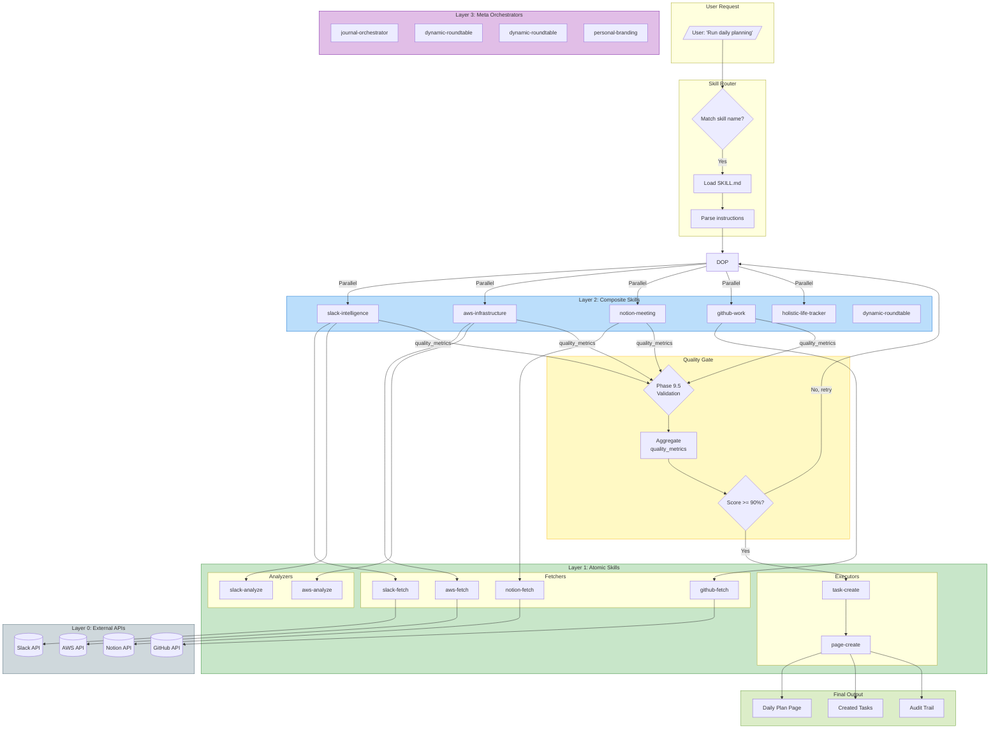
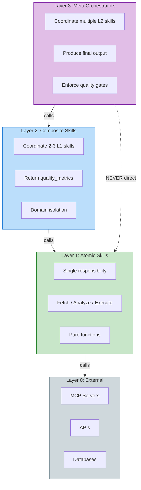
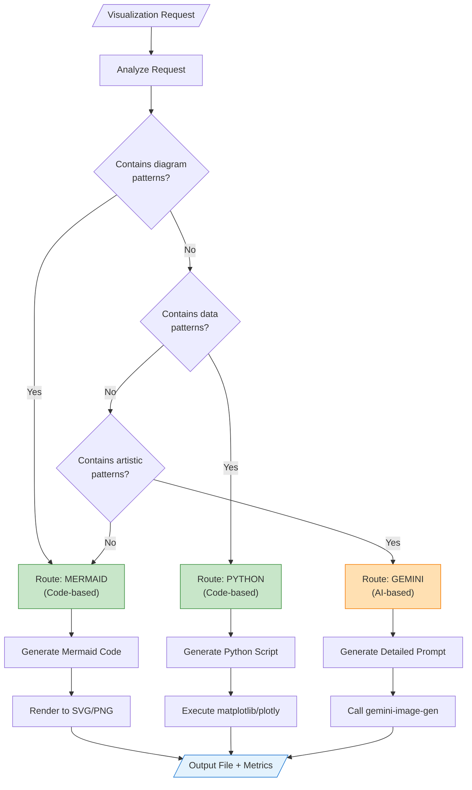

# Example: Architecture Diagram

## Table of Contents
- [Request](#request)
- [Classification](#classification)
- [Generated Mermaid](#generated-mermaid)
- [Rendering Commands](#rendering-commands)
- [Output](#output)


## Request

"Create a diagram showing the complete Claude Boost user flow from request to execution"

## Classification

| Pattern Found | Route |
|---------------|-------|
| "diagram" | MERMAID |
| "flow" | MERMAID |
| "architecture" | MERMAID |

**Decision: MERMAID** (code-based, deterministic)

## Generated Mermaid

### Complete User Flow Diagram



### Simplified 3-Layer Architecture



### Visualization Routing Flow



## Rendering Commands

### Save as SVG (recommended for diagrams)
```bash
# Install mermaid CLI
npm install -g @mermaid-js/mermaid-cli

# Convert to SVG
mmdc -i user-flow.mmd -o user-flow.svg

# Convert to PNG with transparent background
mmdc -i user-flow.mmd -o user-flow.png -b transparent -s 2
```

### Embed in Markdown

The Mermaid code above can be directly embedded in:
- GitHub README files
- Notion pages (using code blocks)
- GitLab wikis
- Obsidian notes

## Output

```json
{
  "visualization_type": "MERMAID",
  "output": {
    "format": "mermaid_code",
    "rendered_formats": ["svg", "png"],
    "file_path": "user-flow.svg"
  },
  "quality_metrics": {
    "route_confidence": 0.98,
    "tool_used": "mermaid",
    "generation_method": "code",
    "deterministic": true,
    "complexity": "high",
    "nodes": 45,
    "edges": 38
  },
  "reasoning": "Request contains 'diagram', 'flow', 'architecture' patterns - routed to Mermaid for code-based generation"
}
```
