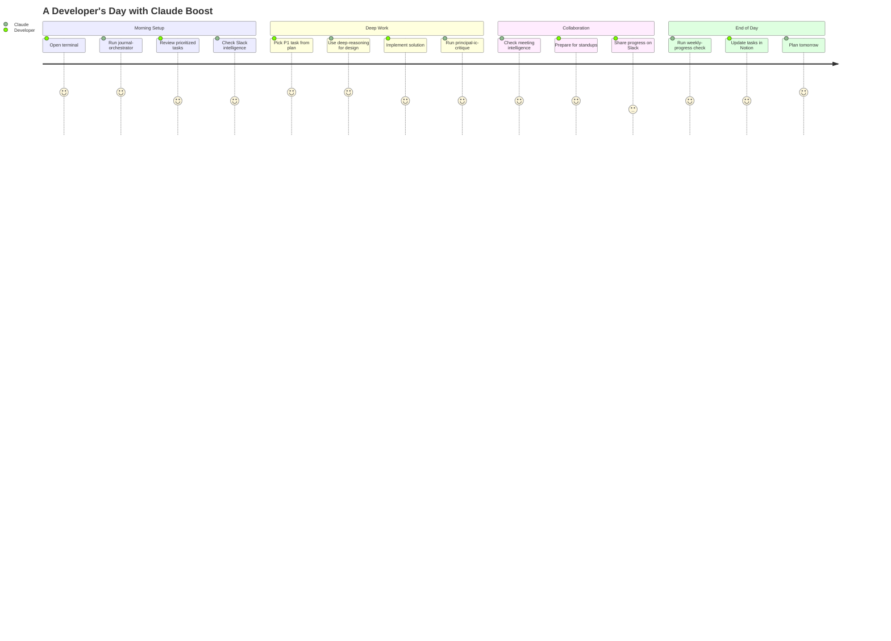
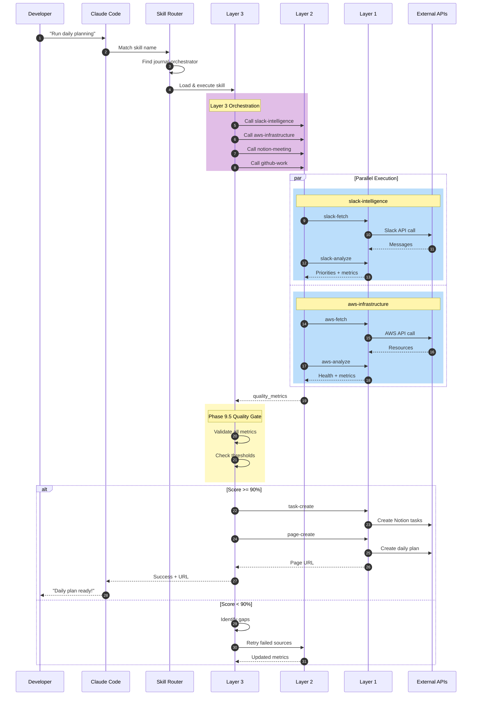
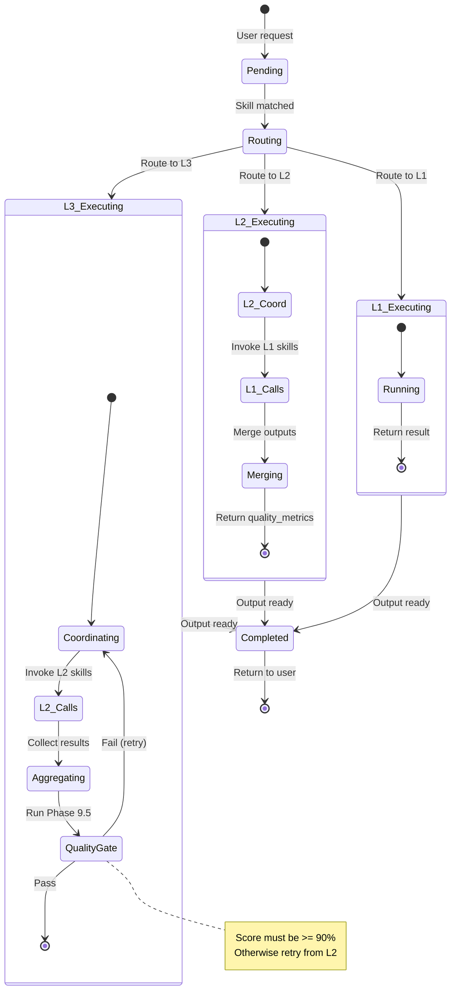
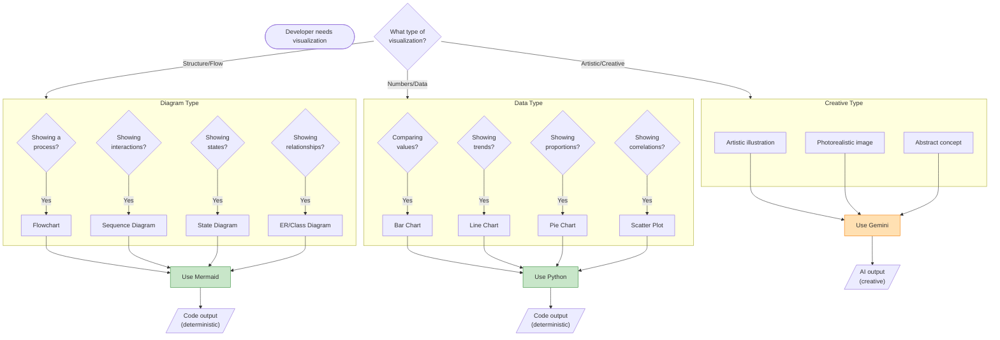
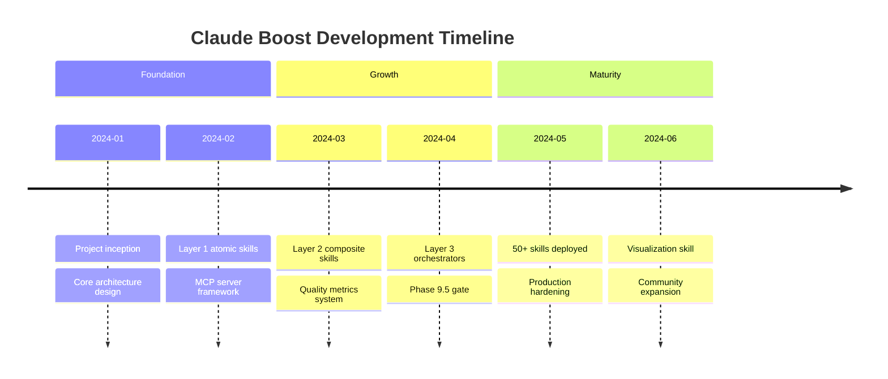

# Example: User Flow Diagram

## Table of Contents
- [Request](#request)
- [Classification](#classification)
- [Generated Mermaid](#generated-mermaid)
- [Rendering](#rendering)
- [Output](#output)


## Request

"Create a user journey diagram showing how a developer uses Claude Boost daily"

## Classification

| Pattern Found | Route |
|---------------|-------|
| "user journey" | MERMAID |
| "diagram" | MERMAID |
| "flow" | MERMAID |

**Decision: MERMAID** (code-based, deterministic)

## Generated Mermaid

### Daily Developer Journey



### Detailed Request-Response Flow



### State Machine: Skill Execution



### User Decision Tree



### Timeline: Project Development



## Rendering

### Embed in Documentation

All diagrams above can be embedded directly in:
- GitHub README.md
- Notion pages (code block)
- GitLab wikis
- Obsidian notes

### Export to Images

```bash
# Install mermaid CLI
npm install -g @mermaid-js/mermaid-cli

# Export all diagrams
mmdc -i journey.mmd -o journey.png -s 2
mmdc -i sequence.mmd -o sequence.svg
mmdc -i state.mmd -o state.svg
mmdc -i decision.mmd -o decision.png -s 2
```

## Output

```json
{
  "visualization_type": "MERMAID",
  "output": {
    "diagrams": [
      {"type": "journey", "purpose": "User journey map"},
      {"type": "sequenceDiagram", "purpose": "Request-response flow"},
      {"type": "stateDiagram-v2", "purpose": "Execution states"},
      {"type": "flowchart", "purpose": "Decision tree"},
      {"type": "timeline", "purpose": "Project timeline"}
    ],
    "format": "mermaid_code"
  },
  "quality_metrics": {
    "route_confidence": 0.97,
    "tool_used": "mermaid",
    "generation_method": "code",
    "deterministic": true,
    "diagrams_generated": 5
  },
  "reasoning": "Request contains 'user journey' and 'diagram' patterns - routed to Mermaid"
}
```
